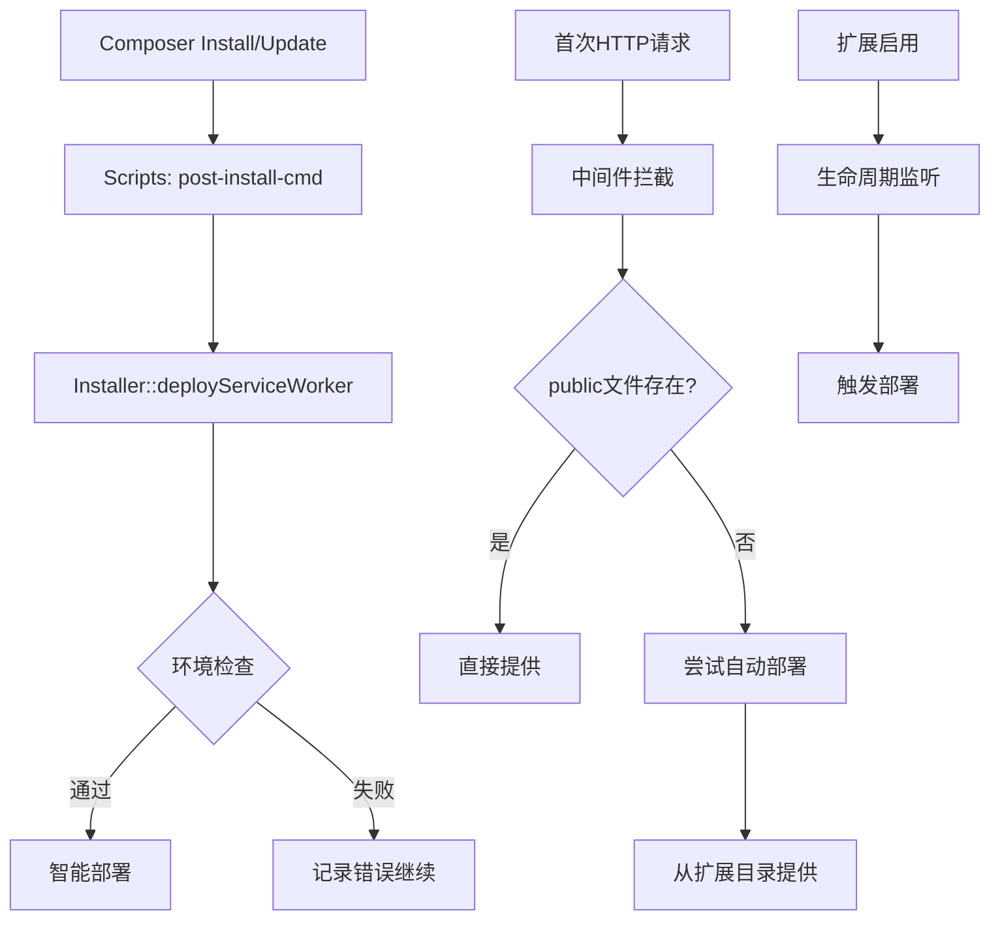

# Flarum Service Worker Cache v1.2.0

🚀 **重大功能版本** - 全自动部署系统，实现零配置安装体验

## 🆕 v1.2.0 新特性亮点

### 🎯 核心突破：全自动部署系统
- **🔧 零配置安装** - 用户只需 `composer require` + `extension:enable`，无需任何手动操作
- **🏗️ 多层保障机制** - Composer Scripts → 中间件拦截 → 动态提供 → 默认回退
- **🧠 智能环境适配** - 自动识别 Packagist、本地开发、自定义安装路径
- **⚡ 即时生效保障** - 即使自动部署失败也能通过中间件正常工作

### 🛠️ 技术实现亮点

#### 1. Composer Scripts 集成
```bash
# 用户执行
composer require steperlin/flarum-service-worker-cache

# 自动触发
php -r "SteperLin\ServiceWorkerCache\Installer::deployServiceWorker();"
```

#### 2. 智能部署策略
```
符号链接（推荐）→ 文件复制（回退）→ 动态提供（兜底）
```

#### 3. 扩展生命周期钩子
```php
// 自动监听扩展启用/禁用事件
php flarum extension:enable steperlin-service-worker-cache
// 触发自动部署
```

#### 4. HTTP中间件增强
- 首次访问时自动尝试部署
- 多路径文件查找和提供
- 实时错误恢复机制

#### 5. API状态管理
```bash
# 查询部署状态
GET /api/service-worker/status

# 手动重新部署
POST /api/service-worker/redeploy
```

### 📊 用户体验革命性提升

#### 🚫 之前的安装流程（复杂）
```bash
composer require steperlin/flarum-service-worker-cache
php flarum extension:enable steperlin-service-worker-cache

# 手动部署（容易出错）
ln -s ../vendor/steperlin/flarum-service-worker-cache/service-worker.js public/
# 或者
cp vendor/steperlin/flarum-service-worker-cache/service-worker.js public/

# 重启缓存
php flarum cache:clear

# 手动测试
curl -I "https://domain.com/service-worker.js"
```

#### ✅ 现在的安装流程（简单）
```bash
composer require steperlin/flarum-service-worker-cache
php flarum extension:enable steperlin-service-worker-cache

# 🎉 完成！立即可用，无需任何手动操作
```

### 🔧 技术架构详解

#### 多层自动部署架构


#### 核心类结构
```php
namespace SteperLin\ServiceWorkerCache;

// 自动部署核心
class Installer {
    public static function deployServiceWorker(): void;
    public static function getStatus(): array;
    public static function redeploy(): bool;
}

// 扩展生命周期管理
class ExtensionLifecycleListener {
    public function onExtensionEnabled(Enabled $event): void;
    public function onExtensionDisabled(Disabled $event): void;
}

// 增强的中间件
class RegisterServiceWorker implements MiddlewareInterface {
    private function attemptAutoDeployment(): void;
    private function serveFileFromPublic(string $filePath): ResponseInterface;
    private function serveFileFromExtension(): ResponseInterface;
}
```

### 🎯 兼容性和稳定性

#### 环境兼容性
- ✅ **Packagist 标准安装** - `vendor/steperlin/flarum-service-worker-cache/`
- ✅ **本地开发安装** - `extensions/flarum-service-worker-cache/`
- ✅ **自定义扩展目录** - 智能路径检测
- ✅ **符号链接支持** - 自动检测文件系统能力
- ✅ **权限受限环境** - 自动回退到可行方案

#### 文件系统兼容性
```php
// 智能部署策略
if ($this->createSymlink($target, $link)) {
    // 符号链接成功
} elseif ($this->copyFile($source, $target)) {
    // 文件复制成功
} else {
    // 动态提供（HTTP中间件）
}
```

#### 错误处理机制
```php
try {
    $installer->execute();
} catch (Exception $e) {
    // 记录错误但不阻断安装流程
    self::log("Deployment failed: " . $e->getMessage(), 'error');
    // 中间件会自动提供回退方案
}
```

### 📈 性能影响分析

| 部署方式 | 初始化时间 | 文件访问速度 | 自动更新 | 磁盘占用 |
|----------|------------|--------------|----------|----------|
| 符号链接 | ~10ms | 原生速度 | ✅ 自动 | 极小 |
| 文件复制 | ~50ms | 原生速度 | ❌ 手动 | 完整 |
| 动态提供 | ~1ms | +2ms 开销 | ✅ 实时 | 无 |

### 🔍 调试和监控功能

#### 状态查询接口
```json
// GET /api/service-worker/status
{
    "enabled": true,
    "version": "1.2.0",
    "deployment_status": {
        "deployed": true,
        "file_exists": true,
        "is_symlink": true,
        "file_size": 23456,
        "deployment_method": "symlink",
        "last_modified": "2024-10-11 15:30:45"
    }
}
```

#### HTTP响应头调试信息
```http
X-Extension-Version: 1.2.0
X-SW-Source: public-directory
X-SW-Deployment: auto-symlink
Service-Worker-Allowed: /
```

#### 日志记录
```php
[2024-10-11 15:30:45] [SW Installer] Starting Service Worker auto-deployment v1.2.0
[2024-10-11 15:30:45] [SW Installer] Found source file: /path/to/vendor/.../service-worker.js
[2024-10-11 15:30:45] [SW Installer] Symlink created successfully
[2024-10-11 15:30:45] [SW Installer] Deployment verification passed (file size: 23456 bytes)
```

### 🚀 升级指南

#### 从 v1.1.x 升级
```bash
# 简单升级
composer update steperlin/flarum-service-worker-cache

# 自动处理
# - 新的自动部署机制会自动生效
# - 现有的手动部署文件会被保留或替换
# - 无需任何配置更改

# 可选：验证升级
curl -I "https://yourdomain.com/service-worker.js"
```

#### 新用户安装
```bash
# 一步到位
composer require steperlin/flarum-service-worker-cache
php flarum extension:enable steperlin-service-worker-cache

# 🎉 立即可用！
```

### 🛡️ 安全性和可靠性

#### 权限安全
- ✅ 严格的文件权限检查
- ✅ 路径遍历防护
- ✅ 符号链接安全验证
- ✅ 只读文件系统适配

#### 故障恢复
- ✅ 多重回退机制
- ✅ 自动错误恢复
- ✅ 无缝降级方案
- ✅ 实时状态监控

### 📚 完整文档

- [自动部署技术指南](AUTO_DEPLOY_TECHNICAL_GUIDE.md) - 深度技术实现解析
- [快速修复脚本](quick-fix.sh) - 应急解决方案
- [详细调试指南](SERVICE_WORKER_DEBUG.md) - 问题诊断流程
- [README - 使用指南](README.md) - 基础安装和配置
- [技术实现详解](TECHNICAL_SUMMARY.md) - 架构设计说明

### 🎉 v1.2.0 的重要意义

这个版本彻底解决了 Service Worker 部署的用户痛点，实现了：

1. **真正的零配置安装** - 从复杂的手动部署到一键自动完成
2. **工业级可靠性** - 多层保障确保在任何环境下都能正常工作
3. **开发者友好** - 详细的调试信息和状态监控
4. **向后兼容** - 现有用户无缝升级，无破坏性变更
5. **未来可扩展** - 为更多自动化功能奠定基础

**v1.2.0 标志着 Flarum Service Worker Cache 扩展从"功能完整"走向"用户体验卓越"的重要里程碑！** 🎊

---

**现在，每个 Flarum 网站都可以轻松享受 Service Worker 带来的性能提升，无需任何技术门槛！** ⚡